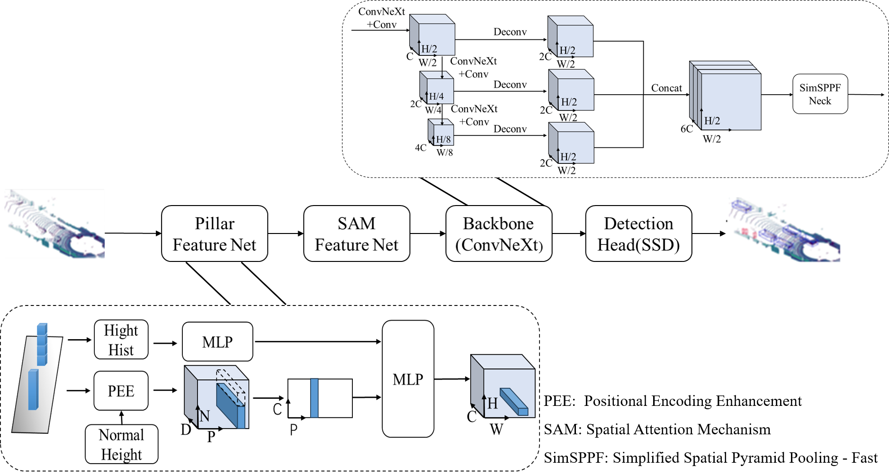

PillarH-CNSNet: Height-Aware Contextual Pillar Network for Enhanced 3D Object Detection
=======
This project is directly related to the manuscript we are currently submitting to The Visual Computer.





PillarH-CNSNet model integrates a height-aware dual-branch encoding structure, a spatial attention feature extraction module, and a lightweight ConvNeXt-based backbone. Our approach significantly enhances feature representation, particularly for small objects, while achieving a balance between accuracy and latency. Experimental results on the KITTI dataset demonstrate outstanding performance, especially for pedestrian detection, with an inference speed of up to 45 FPS. Here, we show that PillarH-CNSNet outperforms state-of-the-art models in both BEV and 3D detection modes, offering a promising solution for real-time 3D object detection.

## Requirements 

### For algorithm: 
* Linux Ubuntu 24.04
* python >= 3.8
* CMake  >= 3.17 
* CUDA   >= 11.8
* PyTorch >= 2.0
* mmdetection3d 
* mmcv   >= 2.2.0
  
### For visualization
* [open3d](https://github.com/intel-isl/Open3D)


## [Install] 

To install **PillarH-CNSNet** and all its dependencies, please refer to the [MMDetection3D](https://mmdetection3d-zh-cn.readthedocs.io/zh-cn/stable/advanced_guides/datasets/kitti.html) Chinese documentation. If any issues occur during installation, you can troubleshoot them according to the instructions in that documentation.
 

## [Datasets]

1. Download
   
  # KITTI Dataset preparation
  
    Download [point cloud](https://s3.eu-central-1.amazonaws.com/avg-kitti/data_object_velodyne.zip), [images](https://s3.eu-central-1.amazonaws.com/avg-kitti/data_object_image_2.zip), [calibration files](https://s3.eu-central-1.amazonaws.com/avg-kitti/data_object_calib.zip) and [labels](https://s3.eu-central-1.amazonaws.com/avg-kitti/data_object_label_2.zip)。Format the datasets as follows:
    ```
    kitti
        |- training
            |- calib (#7481 .txt)
            |- image_2 (#7481 .png)
            |- label_2 (#7481 .txt)
            |- velodyne (#7481 .bin)
        |- testing
            |- calib (#7518 .txt)
            |- image_2 (#7518 .png)
            |- velodyne (#7518 .bin)
    ```

3. Pre-process KITTI datasets First

   ```
    cd PillarH-CNSNet/
    python pre_process_kitti.py --data_root your_path_to_kitti
    ```

    Now, we have datasets as follows:
    ```
    kitti
        |- training
            |- calib (#7481 .txt)
            |- image_2 (#7481 .png)
            |- label_2 (#7481 .txt)
            |- velodyne (#7481 .bin)
            |- velodyne_reduced (#7481 .bin)
        |- testing
            |- calib (#7518 .txt)
            |- image_2 (#7518 .png)
            |- velodyne (#7518 .bin)
            |- velodyne_reduced (#7518 .bin)
        |- kitti_gt_database (# 19700 .bin)
        |- kitti_infos_train.pkl
        |- kitti_infos_val.pkl
        |- kitti_infos_trainval.pkl
        |- kitti_infos_test.pkl
        |- kitti_dbinfos_train.pkl
    ```
    
4. Modify config file

    The config file needs to be edited to point to the above datasets:

   ```
    bash
      train_input_reader: {
        ...
        database_sampler {
         database_info_path: "/path/to/kitti_dbinfos_train.pkl"
        ...
          }
        kitti_info_path: "/path/to/kitti_infos_train.pkl"
        kitti_root_path: "KITTI_DATASET_ROOT"
         }
       ...
       eval_input_reader: {
       ...
       kitti_info_path: "/path/to/kitti_infos_val.pkl"
       kitti_root_path: "KITTI_DATASET_ROOT"
       }
    ```

## [Training]

```
cd PillarH-CNSNet/
python tools/train.py configs/pointpillars/pointpillars_hv_secfpn_8xb6-160e_kitti-3d-3class.py
```

## [Evaluation]

```
cd PillarH-CNSNet/
bash tools/dist_test.sh configs/pointpillars/
pointpillars_hv_secfpn_8xb6-160e_kitti-3d-3class.py work_dirs/
pointpillars_hv_secfpn_8xb6-160e_kitti-3d-3class/latest.pth 8
```

## [Test]

```
cd PillarH-CNSNet/

# 1. infer 
python tools/test.py configs/pointpillars/pointpillars_hv_secfpn_8xb6-160e_kitti-3d-3class.py
epoch_80.pth

# 2. infer and visualize point cloud detection
python tools/test.py configs/pointpillars/pointpillars_hv_secfpn_8xb6-160e_kitti-3d-3class.py
epoch_80.pth --task lidar_det  --show --show-dir . your output_path

```
## [Acknowledements]

Thanks for the open source code [mmcv](https://github.com/open-mmlab/mmcv), [mmdet](https://github.com/open-mmlab/mmdetection) and [mmdet3d](https://github.com/open-mmlab/mmdetection3d).
